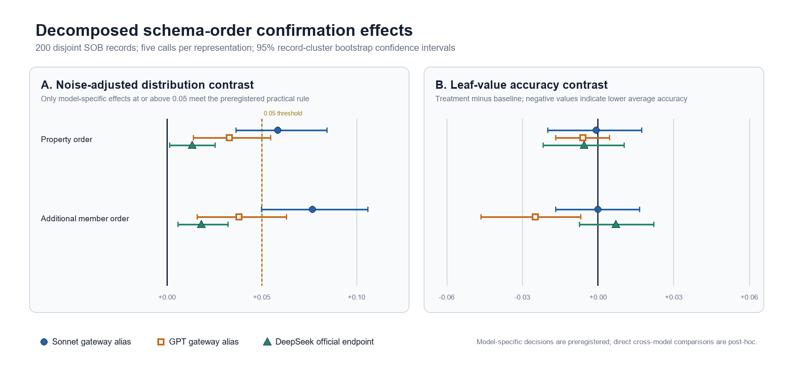
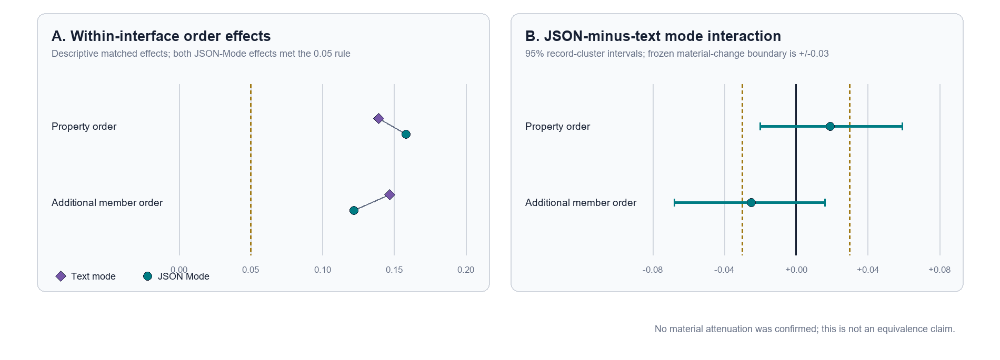

# Testing JSON Schema Instruction Artifacts: Distributional Robustness under Validation-Equivalent Serialization and JSON Mode

**Shengyao Sun**
Shanghai Jiao Tong University, Shanghai, China
Corresponding author: sthfornothing@sjtu.edu.cn
ORCID: 0009-0008-9175-8226

## Abstract

**Context:** Language-model software uses JSON Schema as both an instruction artifact and a validation contract. Software tooling may reorder a Schema without changing validator behavior, yet change model behavior. **Objective:** We test whether validation-equivalent Schema serializations induce output-distribution changes beyond repeated-call variability, whether the changes exceed a prospectively specified practical screen across deployed systems, and whether provider JSON Mode attenuates them. **Method:** We derive metamorphic relations from JSON and JSON Schema semantics, issue five repeated calls per representation, and estimate record-level excess disagreement with cluster bootstrap and permutation inference. The core study contains 17,900 successful responses from two gateway aliases and official DeepSeek/Qwen endpoints, a disjoint 200-record decomposition, and a matched 100-record Qwen text/JSON-Mode ablation. Gateway results characterize observed deployments; upstream checkpoint identities were not independently verified. **Results:** Property-order and additional Schema-member-order effects exceeded 0.05 for the Sonnet gateway (0.058 and 0.077) and Qwen-Plus text deployment (0.126 and 0.123), but not for the GPT gateway (0.033 and 0.038) or DeepSeek (0.013 and 0.018). JSON-Mode effects also exceeded 0.05. Matched JSON-minus-text changes were +0.019 and -0.025; neither was confirmed as a material interaction. Average Schema compliance and leaf-value accuracy did not show universal degradation. **Conclusions:** Validation equivalence is an insufficient regression oracle for LM-facing Schema artifacts. We release an offline-auditable test workflow and conservative canonicalizer; distributional robustness should be tested separately from syntax and task accuracy.

**Keywords:** prompt testing; JSON Schema; structured output; metamorphic testing; robustness; empirical software engineering

## 1. Introduction

JSON Schema occupies two roles in language-model (LM) software. To conventional software, it is a machine-readable validation contract. To an LM, the serialized Schema is also an instruction artifact: its field names, descriptions, nesting, and textual order help determine what is generated. This dual use creates a subtle maintenance hazard. A serializer upgrade, source-language map implementation, code generator, schema registry, or prompt refactor can reorder object members while preserving every validator-visible constraint. A conventional regression suite sees no contract change. The LM-facing component may nevertheless produce a different distribution of valid answers.

The hazard is not hypothetical at the interface level. JSON defines objects as unordered collections [@rfc8259], and the JSON Schema validation vocabulary does not assign validation meaning to the order of ordinary object members or to a unique `required` list [@jsonschema2020validation]. At the same time, prompt research has repeatedly shown sensitivity to formatting, demonstration order, and other apparently incidental features [@lu2022ordered; @sclar2024format; @kang2025format; @hua2025artifact]. Provider documentation also treats property order as an operational concern in structured generation [@google2026propertyorder]. The unresolved software-engineering question is therefore narrower and more actionable than whether “format matters”: **does a refactoring that preserves the Schema contract preserve the behavior of the LM-enabled component?**

Existing structured-output benchmarks primarily evaluate parseability, Schema validity, feature coverage, or downstream correctness [@geng2025jsonschemabench; @lu2025schemarl; @singh2026sob]. Those measures are necessary but do not test distributional invariance. One call per condition also confounds a representation effect with ordinary stochastic variation. We address both gaps with a JSON-Schema-semantics-derived metamorphic test. The source task, prompt template, system instruction, and validation contract remain fixed. Only the Schema serialization changes. Five calls per representation estimate the variability within each condition, and a noise-adjusted statistic compares cross-representation disagreement with that within-condition baseline.

We study five serialization transformations in an initial 100-record experiment and then isolate two interpretable contrasts on a disjoint 200-record panel: property order, and additional Schema-object member order while property order is held fixed. We retain positive and negative practical replications across deployed interfaces rather than selecting only systems that support the hypothesis. We further test the same 100 Qwen-Plus records in provider JSON Mode. This mode requests a JSON object but is not strict JSON-Schema-constrained decoding; it lets us ask whether syntax-oriented interface support materially changes the representation effect.

The study answers five research questions:

- **RQ1 — Distributional invariance:** Do validation-equivalent Schema serializations change normalized output distributions beyond identical-prompt variability?
- **RQ2 — Decomposed practical effects:** Do property order and additional Schema-object member order independently exceed a prospectively specified 0.05 practical screen across deployed systems?
- **RQ3 — Quality consequences:** Do the distribution changes imply average Schema-compliance or leaf-value-accuracy degradation?
- **RQ4 — Interface boundary:** Does provider JSON Mode materially attenuate the order effects for a matched Qwen-Plus deployment?
- **RQ5 — Heterogeneity:** Are mean effects concentrated in a small subset of records, and are vulnerable-record profiles stable across systems or interfaces?

RQ5 is explicitly exploratory. The JSON Mode ablation was frozen only after the Qwen text-mode interim had been inspected; we disclose that selection and do not present the mode comparison as part of the earlier local frozen analysis plan.

This paper makes five contributions. First, it turns validation equivalence into a metamorphic relation for testing LM-facing Schema artifacts. Second, it provides a stochasticity-adjusted excess-disagreement estimator with record-cluster inference and a prospectively specified practical screen. Third, it reports positive and negative practical replications across gateway aliases and official endpoints, including 17,900 successful core responses. Fourth, it supplies a matched text-versus-JSON-Mode boundary experiment showing that syntax-oriented JSON Mode did not demonstrate attenuation in this Qwen deployment. Fifth, it provides a conservative canonicalizer and a continuous-integration (CI) regression workflow that remove the tested representation degree of freedom by construction.

The durable contribution is the specification-derived test and mitigation workflow, not a point-in-time ranking of hosted models. Deployment estimates are evidence about the named interfaces during the recorded runs and should be remeasured after provider, model, SDK, prompt-wrapper, or Schema-generator changes.

Our claim is deliberately bounded. We do not infer an internal attention mechanism, claim that every model is order-sensitive, establish universal accuracy harm, or evaluate strict constrained decoding. We test deployed black-box systems at recorded dates and conclude that validation equivalence alone is not a sufficient behavioral oracle.

## 2. Background and Related Work

### 2.1 Instruction artifacts in software engineering

Prompted software engineering treats prompts as engineered artifacts that influence the behavior of AI-enabled software [@kim2023promptedse]. In production systems, however, the instruction surface extends beyond prose: system messages, templates, API tool definitions, JSON Schemas, guardrails, and agent communication envelopes are generated, versioned, and transformed by software. Their quality therefore depends on familiar software-engineering concerns—specification, testing, change control, observability, and regression analysis.

Recent reporting guidance for LM-based software-engineering research emphasizes model/version disclosure, prompt justification, execution settings, and threats to reproducibility [@korn2026reporting]. Our design follows that orientation. We preserve requested and returned aliases, endpoint provenance where available, frozen manifests, request keys, response identifiers, prompt hashes, retry rows, and evaluation settings. More importantly, we treat the serialized Schema itself as the unit under test rather than as undocumented prompt scaffolding.

### 2.2 JSON Schema semantics and structured generation

JSON objects are unordered at the data-model level even though a textual JSON document necessarily presents members in a sequence [@rfc8259]. JSON Schema evaluates assertions over the instance and, for the transformations studied here, does not attach validation semantics to the order of Schema-object members. The `required` keyword is an array whose elements must be unique; permuting that unique list preserves its set of required properties [@jsonschema2020validation]. These semantics supply a natural metamorphic relation: transformed Schemas should accept exactly the same instances even though their bytes differ.

Structured-output work has made substantial progress on syntactic and Schema compliance. JSONSchemaBench evaluates constrained-decoding engines and coverage of Schema features [@geng2025jsonschemabench]. Schema reinforcement learning improves valid JSON generation across a large Schema collection [@lu2025schemarl]. The Structured Output Benchmark (SOB), from which our tasks are sampled, separates Schema compliance from content quality across multiple sources [@singh2026sob]. This literature asks whether a system can satisfy a Schema; our study asks whether two serializations of the *same* Schema contract induce the same distribution.

Other close work changes more than serialization. PARSE optimizes Schemas for entity extraction while maintaining backward compatibility [@shrimal2025parse]. StructHallu-Drift mutates database schemas to study semantic hallucinations under schema evolution [@hasan2026structhallu]. OrderBench compares prompt-only and JSON-Schema modes while separating syntactic validity from semantic safety [@li2026orderbench]. These studies establish that schema design, evolution, interface mode, and semantic verification matter. Our distinct boundary is a no-semantic-change maintenance operation: validation-equivalent reordering, repeated under an unchanged task and evaluated as a distributional metamorphic relation.

### 2.3 Prompt order and format sensitivity

Few-shot demonstration order can materially alter task performance [@lu2022ordered], and broad prompt-format studies show that punctuation, separators, and presentation can change model outputs [@sclar2024format]. Later work distinguishes genuine semantic inconsistency from evaluation artifacts and output-format effects [@kang2025format; @hua2025artifact; @ravikumar2026lost]. These findings motivate caution but do not answer the software-maintenance question here. A generic format perturbation may alter readability or intended emphasis. Our transformations are derived from an external formal contract and are automatically checked for equivalence under that contract.

The distinction matters for actionability. If two prompts merely “look similar,” a changed result may be unsurprising. If two Schema artifacts are validator-equivalent and a routine serializer can switch between them, the changed distribution represents an untested cross-layer contract: the validation layer declares equivalence while the generative layer does not.

### 2.4 Stochastic evaluation and black-box deployments

Hosted LM calls can vary across identical requests, and single-run evaluation can exaggerate or obscure treatment effects [@song2024nondeterminism; @bouthillier2021variance]. Coupled generation can improve some comparative evaluations when token-level control is available [@corvelobenz2026coupled], but black-box APIs often expose neither shared randomness nor logits. We instead repeat every record-condition cell and subtract estimated within-condition disagreement from cross-condition disagreement.

Provider systems also drift, and an API alias is not proof of a particular checkpoint [@chen2023drift; @gao2025modelequality]. We therefore make deployment-level claims. Gateway aliases are reported verbatim without treating their upstream identity as independently verified. Official DeepSeek and Alibaba Cloud calls record authenticated catalog checks, requested and returned model strings, and request metadata, but even those results remain tied to the tested endpoint and date.

### 2.5 Metamorphic testing

Metamorphic testing addresses programs for which a complete test oracle is expensive or unavailable by specifying relations that should hold across related inputs and outputs [@chen2018metamorphic]. LM-oriented frameworks have used paraphrases and other transformations to probe qualities without relying on a single gold response [@hyun2024metal]. Our relation is stronger at one layer and intentionally weaker at another: the Schema validator gives a deterministic equivalence oracle for the input transformation, while the LM output relation is statistical rather than exact. We ask whether two equivalent artifacts generate distinguishable normalized-output distributions after accounting for repeated-call noise.

## 3. Study Design

Figure 1 summarizes the method. Context, question, surrounding prompt, system instruction, and validator remain fixed. The treatment is the serialized Schema. Independent deterministic oracles score parsing, Schema compliance, value correctness, and normalized output identity; no LM judge is used.

### 3.1 Study timeline and provenance

The project evolved through separately frozen stages. Table 1 distinguishes the initial experiment, disjoint decomposition, official-endpoint replications, and interface ablation. The first five rows comprise the 17,900 successful responses used in the core evidence. A separate 40-record fixed-snapshot Qwen pilot produced 600 responses but was stopped for cost/entitlement reasons and is neither pooled nor used for a formal result.

| Stage | Records | Systems/interfaces | Representations | Repeats | Successful responses | Status |
|---|---:|---|---:|---:|---:|---|
| Initial five-way study | 100 | Sonnet and GPT gateway aliases | 5 | 5 | 5,000 | frozen primary/replication |
| Disjoint decomposition | 200 | Sonnet and GPT gateway aliases | 3 | 5 | 6,000 | frozen by system |
| Official DeepSeek replication | 200 | `deepseek-v4-flash` text prompt | 3 | 5 | 3,000 | prospectively frozen |
| Official Qwen replication | 160 | `qwen-plus` text prompt | 3 | 5 | 2,400 | staged design, final maximum |
| Qwen interface ablation | 100 | `qwen-plus` JSON Mode | 3 | 5 | 1,500 | prospectively frozen after text interim |

The primary 100-record panel was frozen before confirmatory calls. The 200-record decomposition has no overlap with that panel, a five-record debugging pilot, or a 20-record engineering gate. The official DeepSeek replication reused the frozen 200-record panel. For the resource-efficient Qwen study, 40 records seen in the discontinued fixed-snapshot pilot were excluded; the remaining 160 records were ranked before any `qwen-plus` response. Its design allowed one futility-only look at 100 balanced records and continuation to 160 unless *both* contrasts had conditional probability below 0.10 of reaching a final point estimate of 0.05. The rule selected continuation; it did not permit early efficacy.

The JSON Mode experiment used the already frozen 100-record interim subset. It was designed after inspecting the Qwen text-mode interim report. Its two within-mode order contrasts, a 0.03 material interaction threshold, and Holm family were frozen before any JSON-Mode completion. This timing raises a selection threat, which we address by labeling the ablation as a later boundary experiment and retaining all outcomes.

### 3.2 Dataset and sampling

We use text tasks from SOB [@singh2026sob]. Each record contains context, a question, a target JSON Schema, and a gold JSON object. The initial panel balances 50 medium- and 50 hard-complexity Schemas. The disjoint panel contains 100 medium and 100 hard records. Source gold objects were validated against their associated Schemas during preparation. Generation files contain context, question, public metadata, and Schema variants; gold answers are kept separately and joined by `record_id` only during evaluation.

The public primary file has SHA-256 `a09e7a4cf828eabdc1b76b51e2e2c72f8033560bc64979809b7c907680560b26`; the disjoint public file has SHA-256 `1553aa33a5cd76696acfa7c4ec6a00caab5b0858dee76be330db2d7f0a2a40c2`. Selection manifests preserve record identifiers and balancing strata.

The decomposition requires all three retained serializations to be byte-distinct and requires `properties_reversed` and `keywords_reversed` to have identical recursive property-order signatures. After excluding earlier-study identifiers, eligible medium and hard records were selected by frozen SHA-256 rank. Consequently, the decomposed estimand concerns records for which both interventions are nontrivial; it does not represent Schemas on which a reordering is a byte-level no-op.

### 3.3 Validation-equivalent transformations

For each Schema object (S), the initial study constructs five recursive serializations:

- **Original:** the source serialization.
- **Properties reversed:** reverse entries inside every `properties` object.
- **Required reversed:** reverse each unique `required` array.
- **Keywords reversed:** reverse members in every Schema object, including members of nested `properties` objects.
- **Descriptions first:** move `description` to the first position wherever present.

These transformations belong to one metamorphic family because each changes the serialized instruction while preserving the audited validator-visible contract, but they probe different representational mechanisms. `descriptions_first` moves an annotation rather than an assertion keyword; it tests whether validator-irrelevant annotation placement changes the LM-facing instruction. `required_reversed` is deliberately limited to unique arrays because JSON Schema gives that array set-like validation meaning, whereas other arrays may be order-sensitive. The two variants are therefore distinct diagnostic contrasts, not interchangeable instances of object-member reversal.

All transformations changed bytes for all initial records except `descriptions_first`, which was a no-op for two; those two remain in the intent-to-treat analysis. Each pair is checked through a normalized signature that recursively sorts JSON object members and the order-insensitive unique `required` arrays. Any signature mismatch aborts task creation. An independent audit additionally validates transformed Schemas and confirms that stored gold instances retain the same accept/reject outcome under the dialects used by the paper.

The initial named variants are composite interventions against `original`, not a factorial decomposition. In particular, `keywords_reversed` changes both property order and other Schema-object member order. The disjoint follow-up therefore retains only `original`, `properties_reversed`, and `keywords_reversed`. It defines:

1. **Property-order contrast:** `original` versus `properties_reversed`.
2. **Additional-member-order contrast:** `properties_reversed` versus `keywords_reversed`.

The second comparison holds recursive property order fixed and changes remaining Schema-object member order. It still aggregates several keyword positions and must not be interpreted as the causal effect of one specific keyword.

### 3.4 Prompt, systems, and interfaces

The system instruction requests exactly one JSON object satisfying the supplied Schema and prohibits Markdown, comments, explanations, and additional fields. The user message contains fixed `Context`, `Question`, and `JSON Schema` sections followed by an instruction to return only the object. For all text-mode studies, the Schema is ordinary prompt text; no native structured-output parameter is sent.

The two gateway experiments requested and received the aliases `claude-sonnet-5` and `gpt-5.5` through a third-party API gateway. In informal communication in August 2026, the gateway operator stated that the Sonnet and GPT routes ultimately used Anthropic and OpenAI commercial API platforms, respectively, and reported operator-side comparisons consistent with official-API behavior. The operator also made clear that no written routing, billing, or subscription evidence was available for external verification. We therefore treat this communication as provenance-supporting but not dispositive: neither upstream checkpoint identity, wrapper, nor per-request route was independently authenticated, and all conclusions refer to the observed gateway deployments. Calls were interleaved by a deterministic SHA-256 ordering of study, record, condition, and repeat identifiers. Results were appended immediately; resumptions skipped successful request keys. Transient error rows were retained, but every expected cell eventually completed.

Across the seven core run logs, 17,900 successful responses were accompanied by 20 standalone top-level error rows, for 17,920 logged rows in total; every affected frozen request key later completed. A further 28 successful rows recorded at least one internal transport retry before success. No representation accumulated more than six top-level error rows across all stages. These sparse counts are reported for transparency but are too small for a reliable representation-specific availability comparison; no failed cell was silently removed from the analysis.

The official DeepSeek replication used the provider's OpenAI-compatible endpoint and `deepseek-v4-flash`. An authenticated catalog gate and a three-call smoke gate preceded the frozen run. The requested and returned aliases were stable. The provider's documented default thinking behavior was retained; only final answer content was scored, while reasoning text was represented by length and hash. Native `response_format`, tools, and strict structured-output controls were omitted.

The official Alibaba Cloud replication requested the real-time alias `qwen-plus`, disabled thinking, and confirmed a stable returned alias. The text-mode run contains 2,400 successful requests over 160 records. The matched JSON Mode arm uses the same alias with `response_format={"type":"json_object"}` on 1,500 requests. Provider documentation describes this as JSON-oriented output [@alibaba2026jsonmode]. It does not receive the record's full Schema as a strict decoding constraint; the Schema remains in prompt text. We therefore call it **JSON Mode**, not “JSON Schema mode” or constrained decoding.

Across core runs, operational gates verify counts, unique successful request keys, returned aliases, response identifiers where available, and prompt-repeat consistency. Overall Schema pass rates range from 98.73% to 99.92%, leaving sufficient valid output while preventing parse failure from dominating the distribution statistic.

### 3.5 Execution contract and model settings

Table 2 reports the successful-response windows and endpoint-level settings that define each deployment observation. Times are UTC and are the first and last successful rows in the corresponding run log; smoke calls and transient errors are documented separately in the artifact. The gateway base URL is intentionally withheld from the public manuscript because it identifies a small private relay; its request path was OpenAI-compatible `/chat/completions`, and no gateway region field was exposed.

| Interface/stage | Successful-response window (UTC) | Requested/returned model | Endpoint and region | Request contract |
|---|---|---|---|---|
| Sonnet gateway, primary / decomposition | 2026-07-17 10:07–16:05 / 2026-07-19 07:50–13:39 | `claude-sonnet-5` / same | Private OpenAI-compatible gateway; region not exposed | `max_tokens=4096`; temperature, top_p, seed omitted; text mode |
| GPT gateway, primary / decomposition | 2026-07-17 16:22–2026-07-18 04:59 / 2026-07-19 13:48–2026-07-21 09:44 | `gpt-5.5` / same | Private OpenAI-compatible gateway; region not exposed | `max_tokens=4096`; temperature, top_p, seed omitted; text mode |
| DeepSeek official | 2026-07-24 05:41–14:27 | `deepseek-v4-flash` / same | `https://api.deepseek.com/v1`; provider region not returned | `max_tokens=4096`; provider-default thinking; response_format and tools omitted |
| Qwen-Plus official text | 2026-08-01 14:46–2026-08-02 03:19 | `qwen-plus` / same | `https://dashscope.aliyuncs.com/compatible-mode/v1`; provider region not returned | `max_tokens=4096`; `enable_thinking=false`; response_format omitted |
| Qwen-Plus official JSON Mode | 2026-08-02 04:18–05:02 | `qwen-plus` / same | Same Alibaba endpoint; provider region not returned | `max_tokens=4096`; `enable_thinking=false`; `response_format={"type":"json_object"}` |

Across all runs, `stream=false`, no tools were sent, and no seed was supplied. The runner used Python 3.12.13, `httpx` 0.28.1, and `jsonschema` 4.26.0. The request timeout was 240 seconds. Each request allowed at most three attempts; HTTP 429, HTTP 5xx, timeouts, and network errors used exponential backoff of 1 and 2 seconds, while other 4xx responses stopped the run. Five consecutive request errors paused execution for resumable inspection. The complete request rows, prompt hashes, returned model strings, and retry records are included in the online resource.

The exact system prompt was: “You are a precise information extraction system. Answer using only one JSON object that satisfies the supplied JSON Schema. Do not add markdown, explanations, comments, or fields not allowed by the schema. Use only the provided context.” The exact user-template, with only record-specific fields substituted, was: “# Context\\n{context}\\n\\n# Question\\n{question}\\n\\n# JSON Schema\\n{schema_serialization}\\n\\nReturn only the JSON object.” This template was identical across representations; only `{schema_serialization}` changed.

### 3.6 Deterministic outcome measures

Every response is scored without an LM judge:

- **Schema pass rate:** the fraction of parsed objects accepted by the record's Schema.
- **Leaf-value accuracy:** exact JSON-type-and-value agreement over gold leaf paths. A Schema-invalid response or one covering less than 95% of gold paths receives zero.
- **Value-token F1:** token overlap at corresponding gold leaves after lowercasing, punctuation/article removal, and whitespace normalization, with the same validity/coverage guard.
- **Perfect-response rate:** canonical JSON equality with the complete gold object.

For distributional stability, parsed objects are canonicalized by sorting object keys. String leaves receive the same token normalization used for value F1. Parse failures receive explicit failure signatures. This removes output-object key order from the outcome: the paper tests changes in generated content, not whether the model echoes the input order.

For record \(i\), let \(A_i\) and \(B_i\) be the five normalized output signatures under two Schema representations. Let \(D_{\mathrm{within}}\) be the unequal-pair proportion among the ten unordered pairs within a condition, and \(D_{\mathrm{cross}}\) the unequal-pair proportion among the 25 cross-condition pairs. The record-level excess disagreement is

\[
E_i(A,B)=D_{\mathrm{cross}}(A_i,B_i)-\frac{1}{2}\left[D_{\mathrm{within}}(A_i)+D_{\mathrm{within}}(B_i)\right].
\]

The reported effect is the frozen-sample mean of \(E_i\). Positive values indicate that the two representations disagree more than expected from their own repeated-call variability. If \(p_i(z)\) and \(q_i(z)\) are the population probabilities of normalized signature \(z\), then

\[
\mathbb{E}[E_i]=\frac{1}{2}\sum_z\left(p_i(z)-q_i(z)\right)^2.
\]

Thus the population estimand is one half of squared \(L_2\) distance between discrete output distributions, equivalently one half of squared maximum mean discrepancy under the Kronecker-delta kernel [@gretton2012kernel]. The pairwise construction is an unbiased U-statistic under independent repeats. A finite-sample record value can be negative even though the population quantity is nonnegative.

### 3.7 Inference and decision rules

Confidence intervals use 5,000 record-cluster bootstrap resamples. Distribution p-values use 5,000 within-record label permutations, and accuracy p-values use record-level sign flips. The record—not the individual API response—is the resampling unit. Holm correction is applied within each prospectively specified metric family: four non-original variants in the initial study, two decomposed contrasts in each later study, and two mode-by-order interactions in the matched ablation.

Before the confirmatory 100-record calls, the study defined 0.05 normalized excess disagreement as a practical screen: five percentage points of cross-representation disagreement beyond the mean within-representation baseline, approximately one additional changed output per twenty cross-condition comparisons after noise adjustment. A contrast is confirmed only when its estimate is at least 0.05, its 95% interval has a lower bound above zero, and its Holm-adjusted p-value is below 0.05. This is a descriptive benchmark for separating effect magnitudes in this study, not a business-loss, safety, reliability, or industry-standard threshold. A deployment should recalibrate it against its own consequence costs; we report all estimates and intervals, including statistically detectable effects below it.

The Qwen mode interaction is JSON-Mode excess minus text-mode excess on the matched 100 records. A material interaction requires an absolute change of at least 0.03, an interval excluding zero, and Holm-adjusted (p<0.05). Failure to meet this rule is **not** an equivalence conclusion; its interval may still contain modest attenuation or amplification.

### 3.8 Exploratory robustness analyses

After viewing earlier reports, we assessed effect concentration with the median, symmetric 10% trimmed mean, the mean after removing the largest 10% of record effects, complexity-stratified means, and the share of positive mass contributed by the top decile. We also computed Spearman correlation between record-level effects for every system pair on shared records, with bootstrap intervals, permutation tests, and one global Holm correction across the 20 pair-by-contrast comparisons. These analyses explain heterogeneity but do not alter any frozen decision.

### 3.9 Schema canonicalization intervention

The artifact includes a conservative canonicalizer intended for build pipelines. It recursively sorts object members, sorts only unique string arrays under `required`, and preserves every other array because order may be semantically meaningful for keywords such as `prefixItems` or application-specific extensions. This is not a general JSON Schema equivalence checker. On all 200 disjoint records, the canonicalizer maps `original`, `properties_reversed`, and `keywords_reversed` to one byte-identical representation (200/200 audit pass). It therefore removes the tested serialization degree of freedom without claiming to normalize every semantically equivalent Schema.

## 4. Results

### 4.1 Answer-first overview

Table 3 reports the central decomposed results. Both effects crossed the 0.05 rule in the Sonnet gateway and official Qwen-Plus text deployments. Both remained below 0.05 for the GPT gateway and official DeepSeek endpoint, despite intervals and adjusted p-values supporting nonzero effects. This is evidence of deployment-contingent practical magnitude, not a formal ranking of model families.

| System | Records | Property-order excess (95% CI) | Additional-member excess (95% CI) | Schema pass | Frozen decision |
|---|---:|---:|---:|---:|---|
| Sonnet gateway alias | 200 | 0.0584 [0.0363, 0.0845] | 0.0768 [0.0498, 0.1061] | 99.70% | both confirmed |
| GPT gateway alias | 200 | 0.0329 [0.0140, 0.0548] | 0.0380 [0.0159, 0.0632] | 99.33% | neither reached 0.05 |
| DeepSeek official | 200 | 0.0133 [0.0014, 0.0254] | 0.0182 [0.0057, 0.0322] | 99.63% | neither reached 0.05 |
| Qwen-Plus official text | 160 | 0.1255 [0.0861, 0.1674] | 0.1229 [0.0853, 0.1624] | 99.33% | both confirmed |

All Sonnet, GPT, and Qwen adjusted p-values in Table 3 are 0.0004. DeepSeek adjusted p-values are 0.0132 and 0.0016. Statistical detectability is therefore not the same as the frozen practical decision.

### 4.2 RQ1: validation-equivalent reordering can change output distributions

The initial five-way experiment first established the phenomenon on the Sonnet gateway. Relative to `original`, property reversal yielded normalized excess disagreement 0.0831 (95% CI [0.0460, 0.1279], Holm (p=0.0008)); recursive keyword reversal yielded 0.0703 ([0.0391, 0.1067], (p=0.0008)). Both exceeded 0.05. Required reversal produced 0.0328 ([0.0091, 0.0620]), and descriptions-first produced 0.0270 ([0.0088, 0.0495]); these statistically detectable but smaller effects did not pass the practical rule.

The same 100 records on the GPT gateway showed smaller effects: 0.0389 for property reversal, 0.0109 for required reversal, 0.0287 for keyword reversal, and 0.0015 for descriptions-first. None reached 0.05. The contrast between the two gateway reports was not itself prospectively specified. Post-hoc paired Sonnet-minus-GPT comparisons did not survive Holm correction, so the correct conclusion is not that one underlying model is proven more susceptible. Rather, the study observed a practical confirmation in one gateway deployment and a replication that did not meet the practical screen in the other.

Required-array reversal was smaller than property reversal in both initial gateways, and descriptions-first was smaller still. One plausible interpretation is that models treat the contents of `required` more like set-valued metadata and rely less on annotation placement than on property presentation. The study does not isolate attention or parsing mechanisms, however, and two descriptions-first transformations were byte-level no-ops. We therefore retain this as an observed pattern and replication hypothesis rather than a causal explanation.

The disjoint decomposed studies then reproduced nonzero representation effects across four text-mode deployments (Table 3). Every one of the eight intervals has a positive lower bound. **Answer to RQ1:** validator-equivalent serialization can change normalized black-box output distributions beyond repeated-prompt variability, but magnitude is system- and deployment-contingent.

### 4.3 RQ2: property and additional member order are separable in the tested design

The decomposed Sonnet follow-up confirmed both contrasts. Property order produced 0.0584 and additional member order, with recursive property order held fixed, produced 0.0768. The official Qwen-Plus text run produced still larger estimates, 0.1255 and 0.1229. Each estimate exceeded 0.05, each interval excluded zero, and each Holm-adjusted p-value was 0.0004.

GPT produced 0.0329 and 0.0380. DeepSeek produced 0.0133 and 0.0182. Their positive intervals and adjusted p-values indicate detectable shifts, but none passed the practical magnitude screen. Retaining these negative practical replications is essential: choosing only Sonnet and Qwen would overstate generality, while treating the smaller results as “no effect” would discard evidence supported by the statistical tests.

The decomposition changes the interpretation of the original keyword-reversal result. It shows that a representation shift remains after property order is held fixed; it does not identify which individual keyword position causes it. **Answer to RQ2:** both decomposed order dimensions exceeded the prospectively specified screen in two deployments and remained below it in two. No universal threshold-crossing effect is established.

### 4.4 RQ3: distribution shift did not imply universal average quality loss

Table 4 separates the distribution estimand from leaf-value accuracy. Sonnet's decomposed accuracy contrasts are effectively zero. DeepSeek's are small and in opposite directions. Qwen text-mode point estimates are -0.0177 for property order and +0.0063 for additional member order; both intervals include zero. In JSON Mode they are -0.0246 and +0.0089, again with intervals including zero.

| System/interface | Property-order accuracy difference (95% CI) | Additional-member accuracy difference (95% CI) |
|---|---:|---:|
| Sonnet gateway text | -0.0007 [-0.0199, 0.0174] | +0.0000 [-0.0167, 0.0166] |
| GPT gateway text | -0.0059 [-0.0167, 0.0046] | -0.0248 [-0.0463, -0.0067] |
| DeepSeek official text | -0.0054 [-0.0217, 0.0104] | +0.0071 [-0.0073, 0.0222] |
| Qwen-Plus official text | -0.0177 [-0.0392, 0.0003] | +0.0063 [-0.0142, 0.0251] |
| Qwen-Plus JSON Mode | -0.0246 [-0.0633, 0.0068] | +0.0089 [-0.0243, 0.0397] |

The GPT additional-member contrast is the one secondary exception: -0.0248, with Holm (p=0.0208). Its magnitude remains below the earlier 0.03 engineering context, it was not a primary headline outcome, and it did not reproduce in the other deployments. We report it rather than erase it, but it cannot support a universal accuracy claim.

Schema pass rates remain high in every core run: 99.70% Sonnet, 99.33% GPT, 99.63% DeepSeek, 99.33% Qwen text, and 98.73% Qwen JSON Mode. The slightly lower JSON-Mode rate is compatible with the fact that `json_object` targets JSON syntax, not satisfaction of the supplied prompt Schema. **Answer to RQ3:** distributional instability and average task degradation are empirically distinct. The former is repeatedly observed; the latter is not universal.

### 4.5 RQ4: JSON Mode did not demonstrate attenuation in matched Qwen calls

Within JSON Mode, property-order excess is 0.1582 (95% CI [0.1049, 0.2194]) and additional-member excess is 0.1219 ([0.0724, 0.1803]); both pass the 0.05 rule with Holm (p=0.0004). These are within-interface results, not yet a mode comparison.

On the identical 100 records, text-mode excesses are 0.1391 and 0.1468. The matched JSON-minus-text changes are +0.0191 for property order (95% CI [-0.0199, 0.0594]) and -0.0249 for additional member order ([-0.0677, 0.0162]). Both Holm-adjusted p-values are 0.4951, and both absolute point estimates are below the frozen 0.03 material threshold.

The intervals include modest attenuation and amplification, so this result is not evidence of equivalence and does not prove that JSON Mode has no effect. It establishes a narrower engineering boundary: **in this Qwen-Plus deployment, syntax-oriented JSON Mode did not demonstrate material attenuation of sensitivity to validation-equivalent Schema serialization.** Strict JSON-Schema-constrained decoding may behave differently and remains outside the experiment. This answers RQ4.

### 4.6 RQ5: mean effects are heterogeneous, but matched-interface profiles persist

Every system has a median record effect of zero. Means are therefore driven by a minority of positive records rather than a uniform shift. Table 5 shows how estimates change under two post-hoc concentration checks. Removing the largest-effect decile substantially reduces all means. Sonnet falls to 0.0068 and 0.0166; GPT and DeepSeek become slightly negative. Qwen text remains 0.0488 for property order and 0.0526 for additional member order, while JSON Mode remains 0.0752 and 0.0443. These deletions are stress tests, not alternative confirmatory estimators.

| System/interface | Contrast | Mean | 10% trimmed mean | Mean after largest-decile deletion | Top-decile positive mass |
|---|---|---:|---:|---:|---:|
| Sonnet text | property | 0.0584 | 0.0159 | 0.0068 | 80.2% |
| Sonnet text | additional member | 0.0768 | 0.0269 | 0.0166 | 74.2% |
| GPT text | property | 0.0329 | 0.0049 | -0.0059 | 83.8% |
| GPT text | additional member | 0.0380 | 0.0042 | -0.0066 | 85.8% |
| DeepSeek text | property | 0.0133 | 0.0012 | -0.0104 | 72.0% |
| DeepSeek text | additional member | 0.0182 | 0.0046 | -0.0066 | 72.0% |
| Qwen text | property | 0.1255 | 0.0591 | 0.0488 | 63.3% |
| Qwen text | additional member | 0.1229 | 0.0643 | 0.0526 | 59.5% |
| Qwen JSON Mode | property | 0.1582 | 0.0854 | 0.0752 | 57.0% |
| Qwen JSON Mode | additional member | 0.1219 | 0.0546 | 0.0443 | 65.2% |

Descriptively, hard records have larger effects than medium records in most Sonnet, GPT-property, and Qwen comparisons, but not in both DeepSeek contrasts. The study was neither powered nor prospectively specified for complexity interaction, so this pattern is a hypothesis for replication.

Cross-system record-level correlations are small and none survives global Holm correction. For example, Sonnet versus GPT correlations are -0.030 for property order and -0.132 for additional member order; Sonnet versus Qwen text correlations are 0.058 and 0.172. In contrast, Qwen text versus JSON Mode—same alias, endpoint, and records—shows correlations 0.618 and 0.626, both with global Holm (p=0.0040). **Answer to RQ5:** average effects are concentrated, and “vulnerable records” do not transfer reliably across different deployed systems. They do persist across the matched Qwen interfaces, suggesting that task/Schema features and system-specific behavior jointly shape susceptibility.

### 4.7 High-effect records include substantive and surface-level changes

To make the estimand concrete, we inspected Qwen text-mode records with the maximum observed record effect, \(E_i=1.0\). Table 6 presents three deliberately contrasting cases. This inspection was post-hoc and selected from the upper tail; it is not a random sample, does not estimate how often each pattern occurs, and does not alter any confirmatory decision. In each case, all five responses under each representation were identical within condition and all ten responses were Schema-valid.

| Case | Contrast | Five responses under the left representation | Five responses under the right representation | Interpretation |
|---|---|---|---|---|
| Q-P1 | original vs. properties reversed | `included_creatures`: ghosts, vampires, skeletons, mummies | `included_creatures`: ghosts, vampires | Stable loss of two gold list elements despite Schema validity |
| Q-P2 | original vs. properties reversed | `award_name`: Ron Evans medal | `award_name`: AFL Rising Star | Stable factual substitution in one field; both objects validate |
| Q-P3 | original vs. properties reversed | two dates rendered as `May 1, 1999` | the same dates rendered as `1999-05-01` | Surface normalization that changes exact outputs without changing the calendar date |

The cases show why excess disagreement is a diagnostic rather than a harm score. Q-P1 is a gold-content loss, Q-P2 is a task-relevant factual substitution, and Q-P3 is a surface-equivalent date rendering change. We observed no action-changing or unsafe case in this small post-hoc inspection, so we do not infer their absence in production. All three are operationally observable to exact-output caches, snapshot tests, audit diffs, or downstream string consumers, but they do not by themselves establish economic, safety, or user-experience harm. Production thresholds should therefore be paired with domain-specific consequence metrics and, where available, a domain-specific semantic/action classifier.

## 5. Engineering Method and Practical Use

### 5.1 A regression oracle for instruction artifacts

Traditional Schema tests answer “do these instances still validate?” The proposed metamorphic test adds “does the LM-enabled component behave similarly after a validator-equivalent artifact change?” A practical CI job can implement four stages:

1. **Equivalence gate:** generate original and transformed serializations, reject any normalized-signature or validator mismatch, and record hashes.
2. **Repeated execution:** run a representative frozen record panel several times under each serialization, with deterministic cell scheduling and resumable request keys.
3. **Independent evaluation:** normalize outputs and compute Schema compliance, task metrics, within-condition variability, and cross-condition disagreement without an LM judge.
4. **Regression decision:** compare excess disagreement and downstream metrics with project-specific limits, while reporting intervals rather than a binary pass alone.

This workflow is suited to schema generator upgrades, provider/model migrations, prompt-template refactors, SDK changes, and agent/tool-definition changes. It is also compatible with a low-cost canary panel: a team can select records from its own production distribution, calibrate a utility-based threshold, and reserve a larger panel for failures or periodic audits.

### 5.2 Canonicalization as prevention

Testing detects sensitivity; canonicalization removes one cause. When Schema order is not an intended instruction, the build should serialize a canonical form before hashing, caching, reviewing, or sending it to an LM. The supplied canonicalizer deliberately has a narrow trust boundary. It sorts object keys and unique `required` arrays and preserves all other arrays. The 200/200 collapse audit demonstrates that it eliminates the exact property/member-order transformations in this study, not that it decides arbitrary Schema equivalence.

Canonicalization offers three engineering benefits. It stabilizes prompt diffs, prevents cache fragmentation by byte-different equivalent artifacts, and makes intended order changes explicit. It does not replace output validation or task-specific verification: a stable but wrong output remains wrong, and the results show that high Schema compliance can coexist with semantic variation.

### 5.3 Choosing thresholds

Our 0.05 screen is transparent but not universal. A deployment should connect its threshold to consequences. If a generated object triggers a payment or destructive API action, any change in unsafe-acceptance probability may matter more than average disagreement. If outputs are suggestions reviewed by a human, a larger distribution shift may be acceptable. Teams should therefore retain the distribution statistic as a diagnostic while defining guardrails on business outcomes, unsafe actions, latency, and cost.

A descriptive sensitivity check makes the dependence on this engineering choice explicit. Holding the positive-interval and adjusted-(p<0.05) requirements fixed, a 0.03 magnitude screen would classify both contrasts for the Sonnet gateway, GPT gateway, and Qwen deployment, but neither DeepSeek contrast. The frozen 0.05 screen, prospectively specified in a local analysis plan, classifies both Sonnet and Qwen contrasts and neither GPT nor DeepSeek contrast. At 0.08, only the two Qwen contrasts remain above the screen. These alternative cutoffs do not replace the locally prospectively specified decision; they show that the general finding of nonzero, deployment-contingent sensitivity is stable while the label “practically material” necessarily depends on local costs.

## 6. Discussion

### 6.1 Validation equivalence is a cross-layer, not end-to-end, guarantee

The central finding is a mismatch between two abstraction layers. JSON Schema validators intentionally ignore the tested serialization order. LM-facing software consumes bytes or tokens in sequence. It follows neither logically nor empirically that validation-equivalent artifacts are behaviorally interchangeable. The same pattern appears in compilers, databases, and distributed systems whenever an abstraction hides details that a downstream component can still observe; the engineering response is to test the cross-layer assumption.

This framing avoids a common overclaim. We do not need to know whether the shift arises from positional encoding, token adjacency, instruction parsing, provider middleware, or sampling. Any of those may be relevant scientifically, but a black-box regression failure is actionable before a mechanism is identified.

### 6.2 Positive and negative practical replications define the result

Sonnet and Qwen crossed the study's practical screen; GPT and DeepSeek did not. This heterogeneity is not a defect to conceal. It bounds the claim and argues against universal folklore such as “always put important fields first.” The safer rule is empirical: the deployed combination of model, provider, prompt wrapper, mode, task mix, and Schema generator should be tested.

Likewise, direct Sonnet-versus-GPT comparisons did not survive multiplicity correction, and Qwen used a different eligible sample size. We therefore do not rank vendors. The consistent conclusion across deployments is weaker but robust: nonzero distribution shifts occur, while their engineering magnitude varies.

The gateway labels require an additional boundary: “Sonnet” and “GPT” in this paper identify observed gateway aliases, not independently authenticated vendor checkpoints. Gateway prompt wrapping, routing, caching, or backend changes cannot be separated from the hosted model. The gateway findings therefore support a deployment-testing claim, not an intrinsic Claude-versus-GPT comparison.

### 6.3 JSON syntax support is not semantic invariance

The matched Qwen experiment separates two properties often conflated under “structured output.” JSON Mode improves or requests a syntactic container. The prompt Schema still carries semantic instructions. Because the observed ordering effects concern which values are generated—not merely whether braces parse—syntax-oriented enforcement need not eliminate them. The result aligns with broader evidence that Schema-valid output can remain semantically wrong [@li2026orderbench] and that format reliability and semantic fidelity require separate measures [@hasan2026structhallu].

The experiment does not settle strict constrained decoding. A decoder that masks tokens against the full Schema might change variability, compliance, or semantic choice. Evaluating such engines across matched checkpoints and supported Schema subsets is a useful next study, especially because coverage gaps and engine differences documented by JSONSchemaBench complicate fair comparison [@geng2025jsonschemabench].

### 6.4 Distribution stability and quality answer different questions

A user may care only whether an answer is correct; a maintainer may also care whether a refactor changes which valid answer is produced. Distributional instability can affect downstream caches, audits, fairness analyses, human review load, and reproducibility even when average benchmark accuracy is unchanged. Conversely, a stable distribution can be consistently poor. The measurement stack should therefore retain at least three layers: syntax/Schema validity, semantic task quality, and robustness to instruction-artifact transformations.

### 6.5 Concentration suggests risk-based test selection

The zero medians and large top-decile mass shares show that a small set of records drives much of the average effect. This makes mean-only reporting insufficient, but it also suggests an efficient engineering strategy. Teams can preserve known high-sensitivity cases as regression canaries while periodically refreshing a representative random panel to avoid overfitting. The weak cross-system concordance warns that canaries should be reselected after a provider or model migration. The strong same-Qwen cross-mode concordance suggests that interface changes may preserve which tasks are difficult even when their average effects shift.

## 7. Threats to Validity

### 7.1 Construct validity

Normalized excess disagreement is not a direct utility measure. It intentionally treats any normalized content change as distributional movement. Token normalization may merge distinctions that matter in some domains or retain differences that do not. We counter this by reporting Schema compliance, exact leaf accuracy, token F1 in the artifact, and perfect-response rate separately. The \(L_2\)-distance interpretation clarifies the estimand but does not make 0.05 a universal threshold.

Our transformations are validation-equivalent under the audited subset and dialects, not under every possible vocabulary, custom keyword, annotation consumer, or code-generation tool. `description` is an annotation that may intentionally guide an LM even though it does not constrain validation. The canonicalizer's preservation of non-`required` arrays is deliberately conservative, but arbitrary extensions could still attach order semantics to object members outside standard validation.

JSON Mode means `response_format={"type":"json_object"}`. Calling it constrained decoding or JSON-Schema enforcement would overstate the intervention. We make the request contract explicit and limit the conclusion accordingly.

### 7.2 Internal validity and provenance

The prompt wrapper and task content were held fixed within each experiment, request cells were deterministically interleaved, and response identifiers/request keys were audited. Transient errors were retained and retried to complete frozen cells. The 20 top-level errors and 28 successful rows with internal retries demonstrate that transport reliability was not perfect, although every frozen cell eventually completed. The primary estimand is therefore conditional on eventual successful completion; a permanent, representation-specific availability failure would require a separate reliability outcome. Nevertheless, hosted services can change silently during a run. Stable returned aliases and fingerprints where exposed reduce but do not eliminate this threat.

Gateway model identities are not independently verified. Informal operator communication supports commercial-API routes to Anthropic for Sonnet and OpenAI for GPT, but it does not authenticate either checkpoint, wrapper, or request-by-request routing and was not accompanied by documentary evidence. We therefore refer to gateway aliases rather than official vendor checkpoints. Official endpoints improve provenance but remain mutable services. The Qwen text design used a staged futility rule; continuation followed the frozen criterion, and the full report retains the interim records. The separate fixed-snapshot Qwen pilot was inspected, then excluded from the resource study and never pooled.

The JSON Mode design followed inspection of the Qwen text interim. Even though records and interaction rules were frozen before JSON calls, choosing that follow-up was outcome-informed. We disclose this selection, treat the mode result as a later boundary study, and avoid claiming that it was part of the earlier local frozen analysis plan.

### 7.3 External validity

The benchmark covers medium and hard text-to-JSON tasks, not every Schema construct, domain, language, prompt, temperature, or agent architecture. The disjoint follow-up further conditions on transformations being nontrivial. Five deployed interfaces are not a representative sample of all LMs, and two are gateway aliases. No fixed open-weight checkpoint was tested. Replication with versioned open models, production schemas, other languages, and full constrained-decoding engines is needed.

The use of five repeats balances cost against estimation, but rare outputs may remain unseen. Larger repeat counts would better estimate multi-modal distributions. Our statistic compares normalized complete outputs; a domain-specific semantic distance could be more informative for numeric tolerances, unordered lists, or safety constraints.

### 7.4 Statistical conclusion validity

Cluster bootstrap and permutation tests respect record dependence, and Holm correction controls each declared family. However, several study stages were designed sequentially. The manifests were frozen locally before their corresponding API calls; no OSF, Zenodo, public-commit, or independent timestamp registration is claimed. We therefore describe the local analysis plans as “prospectively specified” and make no formal preregistration claim. We do not pool p-values across stages or reinterpret later results as prospectively specified earlier. Cross-system comparisons, concentration deletions, complexity strata, and concordance are explicitly exploratory.

Failure to cross 0.05 is not evidence of no effect, and failure to confirm a 0.03 mode interaction is not equivalence. The reported confidence intervals are the proper uncertainty bounds. The concentration audit also shows that the mean can be sensitive to the upper tail; this motivates distributional reporting and replication rather than invalidating the frozen mean estimand.

## 8. Reproducibility and Artifact Scope

The accompanying Online Resource distinguishes three reproducibility layers:

1. **Fully reproducible offline:** transformation and canonicalization code, unit tests, dialect checks, report-hash verification, manuscript audits, and reconstruction of all paper tables and figures from frozen aggregate reports. The one-command audit makes no model API call.
2. **Auditable from the public package:** frozen record identifiers and selection manifests, prompt hashes, request settings, returned aliases, response counts, inference code, and aggregate JSON/CSV reports allow reviewers to trace claims and verify protocol consistency without credentials.
3. **Re-executable only with authorized inputs and live services:** full response-level reevaluation requires the original benchmark contexts and gold answers under their source terms, provider credentials, and access to mutable hosted deployments. A future rerun is a replication, not a guarantee of byte-identical responses.

Raw hosted-model responses, credentials, restricted gold answers, and benchmark contexts whose redistribution is not authorized are excluded from the public archive. This boundary prevents the artifact from claiming stronger reproducibility than it supplies. Exact hosted outputs cannot be guaranteed because providers may update deployments; preserving frozen aggregate reports and request provenance supports auditability while versioned open-weight replication remains future work.

Generative AI assistants were used during the project for code drafting, debugging, language editing, and adversarial review. The author chose the research question and design, froze thresholds and record sets, executed the experiments, inspected raw and aggregate outputs, verified calculations and citations, and accepts responsibility for the manuscript. No AI assistant was treated as an author or as an evaluation judge.

## 9. Ethics and Broader Impact

The study uses benchmark text and machine-generated responses and involves no human participants, personal data collection, or intervention with users. Provider calls consumed computational resources; the staged Qwen design and decision to stop adding models reduced unnecessary usage. Total provider-recorded tokens for the formal Qwen text and JSON-Mode arms were 6,820,229, of which 6,535,245 were input and 284,984 output tokens; 827,520 input tokens were reported as cached.

Canonicalization and metamorphic regression tests can improve reliability, but they should not be presented as safety guarantees. A canonical prompt can still yield unsafe content, and a low average distribution shift can hide severe record-specific failures. High-impact applications require domain validation, authorization boundaries, fail-closed execution, and monitoring in addition to Schema checks.

## 10. Conclusion

Validation-equivalent JSON Schema serializations are not necessarily behaviorally interchangeable when the Schema also acts as an LM instruction artifact. Across 17,900 successful core responses, property order and additional Schema-member order produced effects beyond repeated-call variability. Their practical magnitude was deployment-contingent: both crossed 0.05 for the Sonnet gateway and official Qwen deployments, while the GPT gateway and official DeepSeek deployment provided detectable but smaller negative practical replications. Gateway aliases characterize the tested deployments rather than independently verified upstream checkpoints. The shifts did not establish universal average accuracy harm.

For matched Qwen-Plus calls, JSON Mode preserved the requirement to return a JSON object but did not demonstrate attenuation of serialization sensitivity. This is a boundary result, not proof of no mode effect and not evidence about strict Schema-constrained decoding. Post-hoc analyses further show concentrated record-level effects, weak transfer of vulnerable records across systems, and strong concordance across the matched Qwen interfaces.

The practical implication is straightforward: treat Schemas, tool definitions, and other structured LM instructions as versioned software artifacts. The reusable contribution is an offline-auditable metamorphic test, stochasticity-adjusted estimator, conservative canonicalizer, and CI workflow. Canonicalize order when it is not intentional, and test validator-equivalent changes with repeated regression before deployment. Validation equivalence is a useful input oracle; it is not an end-to-end behavioral guarantee.

## Statements and Declarations

### Competing interests

The author declares no financial or non-financial competing interests directly or indirectly related to this work.

### Funding

The author received no external funding for this study.

### Author contributions

Shengyao Sun: conceptualization, methodology, software, investigation, formal analysis, data curation, visualization, validation, writing—original draft, and writing—review and editing.

### Data availability

The public source benchmark is identified and cited in Section 3.2. The reproduction package supplied as Online Resource 1 contains the redistributable processed metadata, frozen manifests, aggregate results, analysis code, figures, and tests supporting the paper. Raw provider outputs, credentials, restricted gold answers, and non-redistributable source contexts are not included; access is subject to the original benchmark and provider terms.

### Ethics approval and human participants

Not applicable. The study did not involve human participants or collect personal data.

## References
