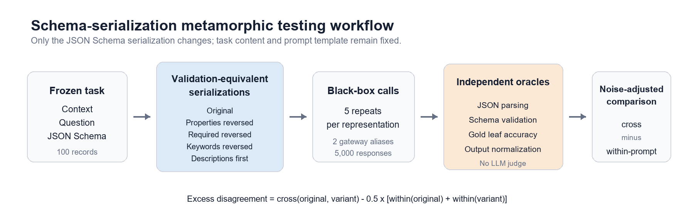
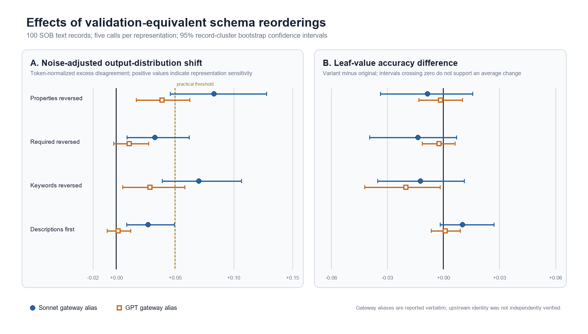

# Equivalent Schemas, Different Distributions: Metamorphic Testing of Schema-Guided JSON Generation under Serialization Reordering

**Anonymous Author(s)**  
*Anonymous submission draft*

## Abstract

JSON Schema can serve as a machine-readable contract in prompts that request structured JSON. The contract is defined by validation semantics, but a language model receives an ordered token sequence: byte-distinct Schema serializations may accept the same JSON instances without inducing the same generation distribution. We test this gap with specification-grounded metamorphic reorderings of `properties`, `required`, Schema-object members, and description position. Each representation is queried five times, and the primary statistic subtracts within-representation disagreement from cross-representation disagreement so that ordinary repeated-prompt variability is not attributed to the reordering. Across a frozen 100-record study, a disjoint preregistered 200-record follow-up, and an official-endpoint replication, we analyze 14,000 successful black-box responses. In the decomposed follow-up, the Sonnet gateway alias reaches a preregistered 0.05 practical threshold for property order (0.058) and additional object-member order with property order held fixed (0.077). The GPT gateway alias shows smaller effects (0.033 and 0.038), and the official `deepseek-v4-flash` endpoint yields still smaller but statistically detectable effects (0.013 and 0.018); neither system reaches the practical threshold. Average correctness does not show a universal degradation: the primary study and official replication support no leaf-accuracy change, while one secondary GPT contrast shows a 0.0248 decrease that remains below an earlier 0.03 engineering-effect context threshold. The evidence therefore supports a testing result, not a universal order rule: validation equivalence does not guarantee output-distribution equivalence, effect magnitude is system-contingent, and distributional stability must be evaluated separately from correctness. We release an auditable, resumable testing pipeline and an offline paper-artifact package.

**Keywords:** large language models, JSON Schema, metamorphic testing, structured generation, prompt robustness, software testing

## 1. Introduction

Large language models are increasingly embedded in software pipelines that turn unstructured text into machine-consumable JSON. A JSON Schema often serves as the interface contract: it identifies required fields, property types, and structural constraints that downstream code expects. Existing structured-output evaluation has therefore emphasized whether an output parses and satisfies its Schema, how efficiently constrained decoders enforce the contract, and whether the generated values are correct [@geng2025jsonschemabench; @singh2026sob].

An unresolved testing question lies between the formal contract and the token-level interface presented to the model. JSON objects are unordered collections in the JSON data model [@rfc8259], and the JSON Schema validation vocabulary defines `required` through membership rather than array position [@jsonschema2020validation]. Consequently, several byte-distinct Schema serializations accept exactly the same instances. An autoregressive LLM, however, receives an ordered sequence. A validator may treat two serializations as equivalent while the generator reacts differently to them.

General prompt-format sensitivity is already well established. Sclar et al. [-@sclar2024format] found large performance spreads across meaning-preserving prompt formats and weak transfer of favorable formats between models. Kang et al. [-@kang2025format] showed that spacing, casing, and separator changes can lead to divergent predictions even when wording is fixed. Output format also affects information extraction performance [@ravikumar2026lost]. These studies preclude a broad claim that format sensitivity itself is novel. They do not, however, directly test validation-equivalent JSON Schema reorderings as software-interface metamorphic relations while estimating the stochastic disagreement of each representation.

This distinction matters because a single response from each representation is insufficient for a probabilistic black-box system. One-shot evaluations can confuse intervention effects with generation noise [@song2024nondeterminism; @bouthillier2021variance]. We therefore collect five independent responses for every task and representation. Our primary measure subtracts average within-representation disagreement from cross-representation disagreement. The resulting excess disagreement estimates whether changing only the Schema serialization separates two output distributions beyond the variability already present within each distribution.

We investigate four research questions:

- **RQ1 (representation effect):** Do validation-equivalent JSON Schema reorderings cause output-distribution shifts beyond identical-prompt stochasticity?
- **RQ2 (cross-system boundary):** Do the observed effects reach the same preregistered practical magnitude in other deployed black-box systems?
- **RQ3 (quality impact):** Do reorderings change Schema compliance, leaf-value accuracy, token F1, or complete-response accuracy?
- **RQ4 (exploratory susceptibility):** Are sensitive records stable across systems, and can simple public Schema features explain sensitivity?

Our contributions are:

1. We define specification-grounded metamorphic relations for JSON Schema serialization and automatically reject transformations whose normalized validation signature changes.
2. We introduce a repeated black-box protocol whose excess-disagreement estimator removes identical-prompt stochasticity and has a discrete two-sample distribution-distance interpretation.
3. We separate syntactic compliance, semantic value accuracy, and output-distribution stability rather than treating any normalized output difference as an error.
4. We report frozen and preregistered evidence across disjoint task samples and an official endpoint, retaining two negative practical replications and providing an offline, auditable testing artifact.

The central result is deliberately narrower than a universal performance-degradation claim. All three observed systems show statistically detectable positive distribution distances on the decomposed contrasts, but only the Sonnet gateway alias reaches the preregistered practical magnitude. The primary 100-record study and official-endpoint replication show no corrected average accuracy loss; the gateway follow-up exposes one small GPT quality signal that requires independent confirmation.

## 2. Background and Related Work

### 2.1 JSON and JSON Schema ordering semantics

RFC 8259 defines a JSON object as an unordered collection of name/value pairs and an array as an ordered sequence [@rfc8259]. Reordering members in a Schema object or a nested `properties` object therefore changes the serialized text but not the underlying JSON object mapping. The JSON Schema Draft 2020-12 validation vocabulary states that an instance satisfies `required` when every string in the keyword's array names a property present in the instance [@jsonschema2020validation]. Permuting those unique strings leaves that predicate unchanged.

We use *validation-equivalent* to mean that the original and transformed Schemas accept the same instance set under the constructs changed in this study. This is not a claim that the serializations have identical tokenizations, identical model representations, or identical operational behavior. That gap is precisely the test target.

### 2.2 Structured-output evaluation

JSONSchemaBench evaluates constrained-decoding systems across efficiency, constraint coverage, and output quality using 10,000 real-world Schemas [@geng2025jsonschemabench]. It focuses on whether decoding frameworks implement Schema constraints reliably and efficiently, rather than whether alternate serializations of the same Schema induce different model behavior.

The Structured Output Benchmark (SOB) separates Schema compliance from the correctness of extracted values [@singh2026sob]. Its text split contains 5,000 records pairing context and question text with a JSON Schema and verified ground truth. SOB reports that models may achieve near-perfect Schema compliance while remaining substantially below perfect Value Accuracy. We reuse its public text tasks, isolated gold answers, and leaf-oriented quality measures. Importantly, SOB's headline evaluation supplies a Schema in the prompt; structured decoding is a separate ablation in its implementation. Our experiment is likewise prompt-based and does not evaluate a provider's native `response_format`, tool-calling, or constrained-decoding API.

### 2.3 Prompt and format sensitivity

Meaning-preserving prompt variations can produce large performance spreads [@sclar2024format]. Related work has examined example order [@lu2022ordered], label-order bias, delimiters, punctuation, and semantically equivalent formatting. Kang et al. [-@kang2025format] are particularly close: they hold wording fixed while changing casing, spacing, and separators, then measure prediction consistency and investigate open-weight model representations. Our study differs in object of analysis and test oracle. The transformations operate on a machine-readable interface contract, equivalence is grounded in validation semantics, and the primary statistic estimates the incremental effect beyond repeated-prompt noise.

Ravikumar et al. [-@ravikumar2026lost] show that informationally equivalent target formats such as JSON, XML, tuples, and free text can substantially change fine-tuned information-extraction performance. We instead hold the target format fixed as JSON and alter only the serialization of the Schema describing that output.

Prompt sensitivity can also be inflated by rigid evaluation. Hua et al. [-@hua2025artifact] find that semantic evaluation reduces variance attributed to prompt templates. This motivates our separation of exact and token-normalized disagreement from gold-based leaf accuracy. We do not interpret every normalized distributional difference as a correctness error.

### 2.4 Stochastic and black-box distributional evaluation

Generation variability is itself part of the behavior of a deployed language-model system. Song et al. [-@song2024nondeterminism] show that single-output evaluations conceal material variation across sampled responses, while broader work on benchmark variance cautions against conclusions that ignore uncontrolled sources of fluctuation [@bouthillier2021variance]. Corvelo Benz et al. [-@corvelobenz2026coupled] reduce comparison variance by coupling token-level randomness across open models. That intervention requires access not provided by the hosted black boxes studied here; repeated calls are therefore our observable baseline.

Our estimand is also related to black-box two-sample testing. Maximum mean discrepancy (MMD) provides a kernel-based distance between distributions and admits unbiased quadratic-time estimators [@gretton2012kernel]. Gao et al. [-@gao2025modelequality] use MMD to test whether a black-box endpoint serves the same output distribution as a reference model. We instead compare two prompt representations sent to the same deployed system and use equality of normalized output signatures as a deliberately transparent kernel. Hosted systems can also change over time [@chen2023drift], which motivates recording call windows, requested and returned identifiers, prompt hashes, and provider metadata. These controls characterize a dated deployment; they do not turn a mutable endpoint into a fixed checkpoint.

### 2.5 Metamorphic testing of LLMs

Metamorphic testing addresses systems for which a complete test oracle is unavailable by checking necessary relations between executions under controlled input transformations [@chen2018metamorphic]. METAL applies modular metamorphic relations to multiple LLM qualities and tasks [@hyun2024metal]. Other LLM testing work uses paraphrases, logic-preserving transformations, or adversarial text perturbations. Our contribution is not the first use of metamorphic testing for LLMs. It specializes the method to Schema-guided JSON extraction using relations derived from interface semantics, automated validation and gold oracles, and a stochasticity-adjusted comparison.

## 3. Study Design

Figure 1 summarizes the workflow. The context, question, system instruction, and surrounding prompt template remain fixed. Only the serialized Schema changes. Each representation is queried repeatedly, after which independent oracles evaluate parsing, Schema compliance, gold value correctness, and normalized output identity.

### 3.1 Dataset and frozen sample

We use the SOB text test split. Before any confirmatory calls, we froze 100 record identifiers for the primary study: 50 medium-complexity and 50 hard-complexity Schemas. A second preregistered follow-up froze 200 additional records, 100 medium and 100 hard, with zero overlap with the primary study, the five-record debugging pilot, or the 20-record repeated-measures engineering gate. All selected source ground-truth objects passed their associated Schemas during dataset preparation. Generation-side files contain only context, question, public metadata, and Schema variants; gold answers remain in separate restricted files joined by `record_id` only during evaluation.

The public primary 100-record dataset has SHA-256 `a09e7a4cf828eabdc1b76b51e2e2c72f8033560bc64979809b7c907680560b26`; the follow-up public dataset has SHA-256 `1553aa33a5cd76696acfa7c4ec6a00caab5b0858dee76be330db2d7f0a2a40c2`. The frozen record-ID lists and all formal reports are preserved in manifests. These samples support record-cluster inference but are not intended to characterize all SOB records or all Schema constructs.

The follow-up eligibility rule required all three retained serializations to be
byte-distinct and required the recursive property-order signatures of
`properties_reversed` and `keywords_reversed` to match. After excluding all
earlier study IDs, we selected the first 100 eligible medium and 100 eligible
hard records under a frozen SHA-256 rank. The follow-up estimand therefore
applies to medium/hard SOB records on which both decomposed interventions are
nontrivial, not to Schemas for which either reordering is a no-op.

### 3.2 Validation-equivalent transformations

For a Schema object (S), we generate the following representations recursively:

- **Original:** the input serialization.
- **Properties reversed:** reverse member order inside every `properties` object.
- **Required reversed:** reverse the unique strings in every `required` array.
- **Keywords reversed:** reverse member order in every Schema object. This is a
  composite transformation: because `properties` is itself a JSON object, its
  entries are reversed as well as the surrounding Schema keywords and the
  members inside property subschemas.
- **Descriptions first:** move `description` to the first serialized position in every object where it occurs.

All four transformations changed bytes for all 100 records except `descriptions_first`, which was a no-op for two records. We retain those records in an intent-to-treat analysis and report 98 applicable records for that transformation.

Every transformed Schema is checked with a normalized signature that recursively sorts JSON object members and order-insensitive `required` values. A signature mismatch aborts task creation. This procedure establishes equivalence for the transformations used; it is not a general theorem prover for arbitrary Schema rewrites.

The preregistered comparisons in the primary study treat each named representation as a complete
intervention against `original`; they do not interpret the transformations as a
factorial design. After the formal reports were frozen, we added an explicitly
post-hoc construct-validity contrast between `properties_reversed` and
`keywords_reversed`. Their recursive property order matches on all 100 records,
so that direct contrast holds property order fixed while changing additional
object-member order. It still does not isolate one individual Schema keyword.

The disjoint follow-up retains only `original`, `properties_reversed`, and
`keywords_reversed`. Its two primary contrasts are `original` versus
`properties_reversed`, and `properties_reversed` versus `keywords_reversed`.
The second contrast therefore holds recursive property order fixed by design.

### 3.3 Prompt and black-box systems

The system instruction requests one JSON object satisfying the supplied Schema and prohibits Markdown, explanations, comments, and additional fields. The user message contains fixed Context, Question, and JSON Schema sections followed by an instruction to return only the JSON object. The Schema is plain prompt text. We do not pass a native structured-output parameter.

We evaluate two gateway model aliases, reported exactly as requested and returned:

| System label | Requested/returned alias | Records | Representations | Repeats | Successful responses | Overall Schema pass |
|---|---|---:|---:|---:|---:|---:|
| Sonnet gateway alias | `claude-sonnet-5` | 100 | 5 | 5 | 2,500 | 99.92% |
| GPT gateway alias | `gpt-5.5` | 100 | 5 | 5 | 2,500 | 99.72% |

The gateway returned one stable model string per experiment and unique response identifiers. Upstream provider identity and model weights were not independently verified; the labels must therefore not be interpreted as verified official model releases. Sampling parameters were omitted because supported parameters could not be assumed across gateway aliases. Calls were deterministically interleaved using SHA-256 of the study, record, and condition identifiers. Every result was appended immediately, and successful request keys were skipped on resume. The primary logs retain 11 transient error rows for the Sonnet run and 3 for the GPT run; the follow-up retains one and two respectively. All expected task keys were eventually completed.

The follow-up produced 3,000 successful responses per alias. Its overall Schema pass rates were 99.70% for Sonnet and 99.33% for GPT. The follow-up was run through the same prompt-only interface and does not evaluate native structured-output or constrained-decoding APIs.

After those results were frozen, we preregistered one additional replication on
the official DeepSeek OpenAI-compatible endpoint. The active scope was narrowed
before any official-provider request to `deepseek-v4-flash`; no unavailable
candidate was replaced after observing outcomes. The replication reused the
same 200 records, 15 repeated conditions, prompt construction, two primary
contrasts, 0.05 practical threshold, and Holm family. The requested model,
returned model, official base URL, authenticated catalog gate, three-call smoke
gate, system fingerprint, and response identifiers were recorded. DeepSeek's
documented default thinking mode was retained, while tools,
`response_format`, and all native structured-output controls were omitted.
Only final answer content was scored; reasoning text was represented by length
and SHA-256 rather than retained.

### 3.4 Metrics

We compute four quality measures for each response:

- **Schema Pass Rate:** proportion of parsed JSON objects accepted by the record's Schema.
- **Leaf Value Accuracy:** exact JSON-type-and-value match over gold leaf paths. Formal repeated-measures scoring sets the value to zero when the response is Schema-invalid or covers less than 95% of gold paths.
- **Value Token F1:** token-overlap F1 over corresponding gold leaves after lowercasing, punctuation removal, article removal, and whitespace normalization, with the same validity/coverage guard.
- **Perfect Response Rate:** canonical JSON equality with the complete ground-truth object.

For distributional stability, every parsed object is canonicalized by sorting object keys. String leaves are additionally token-normalized as above. Parse failures receive explicit failure signatures. For record \(i\), let \(A_i\) and \(B_i\) be the five normalized signatures produced under two representations. Define within-group disagreement as the proportion of unequal unordered pairs within a set and cross-group disagreement as the proportion of unequal Cartesian-product pairs. The record-level excess disagreement is

\[
E_i(A,B)=D_{\mathrm{cross}}(A_i,B_i)-\frac{1}{2}\left[D_{\mathrm{within}}(A_i)+D_{\mathrm{within}}(B_i)\right].
\]

The reported effect is the mean of \(E_i\) over the records in the relevant frozen sample. A positive value indicates that the two representations differ more than would be expected from their own repeated-prompt variability.

This contrast also has a population interpretation. If \(p_i(z)\) and \(q_i(z)\)
are the probabilities of normalized output signature \(z\) under the two
representations, then

\[
\mathbb{E}[E_i]=\frac{1}{2}\sum_z\left(p_i(z)-q_i(z)\right)^2.
\]

Thus, the population quantity is nonnegative and equals one half of the squared
\(\ell_2\) distance between the two discrete output distributions. Equivalently,
it is one half of squared MMD under the Kronecker-delta kernel on normalized
signatures [@gretton2012kernel]. The cross-pair and within-group unordered-pair
calculations form an unbiased U-statistic estimate under independent repeats.
Individual finite-sample record estimates can still be negative; the
record-cluster analysis operates on their frozen-sample mean.

### 3.5 Confirmatory inference and decision rules

Confidence intervals use 5,000 record-cluster bootstrap resamples. Distributional p-values use 5,000 within-record label permutations; accuracy differences use sign-flip permutations. We apply Holm correction across all four non-original variants within each primary-study metric family and across the two decomposed contrasts within each follow-up metric family. The record, not the individual API call, is the resampling unit.

The independent 20-record engineering gate selected `properties_reversed`, `keywords_reversed`, and `descriptions_first` as Sonnet confirmatory hypotheses; `required_reversed` remained exploratory. Before that gate was run, the protocol defined 0.05 normalized excess disagreement as the practical screen: five percentage points of cross-representation pair disagreement beyond the average within-representation baseline. This study-specific threshold is neither a universal loss function nor derived from downstream utility, so we report estimates and intervals whether or not it is crossed. A primary Sonnet effect replicated when its estimate was at least 0.05, its 95% bootstrap interval had a lower bound above zero, and its Holm-adjusted permutation \(p\)-value was below 0.05. Confirmation required at least two primary variants to pass. The second-system primary study froze `properties_reversed` and `keywords_reversed` and applied the same rule. The disjoint follow-up froze two decomposed contrasts and applied the rule separately to each system, with Holm correction across the two contrasts. Accuracy was secondary in the follow-up; no new accuracy threshold was used to alter the distributional decision.

## 4. Results

### 4.1 Answer-first summary

The strongest evidence comes from the disjoint 200-record decomposed design, which separates property order from additional Schema-object member order. All six system-contrast estimates are positive and statistically detectable after within-system Holm correction. Only the two Sonnet estimates meet the frozen practical rule; the GPT and DeepSeek results are negative practical replications rather than zero-effect findings.

| System | Contrast | Normalized excess | 95% CI | Holm \(p\) | Meets 0.05 rule | Leaf-accuracy difference |
|---|---|---:|---:|---:|---|---:|
| Sonnet gateway alias | Property order | 0.0584 | [0.0363, 0.0845] | 0.0004 | Yes | -0.0007 |
| Sonnet gateway alias | Additional member order | 0.0768 | [0.0498, 0.1061] | 0.0004 | Yes | 0.0000 |
| GPT gateway alias | Property order | 0.0329 | [0.0140, 0.0548] | 0.0004 | No | -0.0059 |
| GPT gateway alias | Additional member order | 0.0380 | [0.0159, 0.0632] | 0.0004 | No | -0.0248 |
| DeepSeek official endpoint | Property order | 0.0133 | [0.0014, 0.0254] | 0.0132 | No | -0.0054 |
| DeepSeek official endpoint | Additional member order | 0.0182 | [0.0057, 0.0322] | 0.0016 | No | 0.0071 |

This table is not a confirmatory between-system test. The model-specific estimates answer whether each deployed system crosses a preregistered rule; post-hoc paired comparisons between the two gateway aliases are reported separately and do not survive multiplicity correction.

### 4.2 RQ1: equivalent reorderings shifted the Sonnet-alias output distribution

Figure 2A shows normalized excess disagreement. For the Sonnet gateway alias, `properties_reversed` produced an effect of 0.083 (95% CI [0.046, 0.128], Holm \(p=0.0008\)) and `keywords_reversed` produced 0.070 ([0.039, 0.107], \(p=0.0008\)). Both exceeded the preregistered 0.05 practical threshold, satisfying the frozen confirmation rule.

`descriptions_first`, the third primary Sonnet hypothesis, was positive but below the threshold at 0.027 ([0.009, 0.050], \(p=0.0008\)). The exploratory `required_reversed` effect was 0.033 ([0.009, 0.062], \(p=0.0008\)). These results show detectable representation effects, but the formal practical claim is limited to property and keyword reversal.

| System | Variant | Role in that protocol | Normalized excess | 95% CI | Holm \(p\) | Meets frozen 0.05 rule |
|---|---|---|---:|---:|---:|---|
| Sonnet alias | Properties reversed | Primary | 0.083 | [0.046, 0.128] | 0.0008 | Yes |
| Sonnet alias | Required reversed | Exploratory | 0.033 | [0.009, 0.062] | 0.0008 | No |
| Sonnet alias | Keywords reversed | Primary | 0.070 | [0.039, 0.107] | 0.0008 | Yes |
| Sonnet alias | Descriptions first | Primary | 0.027 | [0.009, 0.050] | 0.0008 | No |
| GPT alias | Properties reversed | Primary | 0.039 | [0.017, 0.063] | 0.0008 | No |
| GPT alias | Required reversed | Exploratory | 0.011 | [-0.002, 0.028] | 0.0996 | No |
| GPT alias | Keywords reversed | Primary | 0.029 | [0.005, 0.059] | 0.0008 | No |
| GPT alias | Descriptions first | Exploratory | 0.001 | [-0.008, 0.012] | 0.4043 | No |

### 4.3 RQ2: the practical magnitude did not replicate in the GPT alias

For the GPT gateway alias, property and keyword reversal again had positive, statistically detectable point estimates, but neither reached 0.05. `properties_reversed` yielded 0.039 (95% CI [0.017, 0.063], Holm \(p=0.0008\)); `keywords_reversed` yielded 0.029 ([0.005, 0.059], \(p=0.0008\)). The preregistered practical-magnitude replication criterion was not met.

This is not evidence of exactly zero effect. Conversely, passing the threshold in one system and failing it in another does not establish that the systems differ. A post-hoc record-paired comparison estimated Sonnet-minus-GPT differences of 0.044 for property reversal (95% CI [-0.003, 0.094], Holm \(p=0.166\)) and 0.042 for keyword reversal ([-0.000, 0.085], \(p=0.166\)). We therefore do not claim a statistically supported between-system sensitivity difference.

### 4.4 Disjoint follow-up: both decomposed contrasts confirmed for Sonnet, not for GPT

The preregistered 200-record follow-up separates property order from additional
Schema-object member order. For the Sonnet alias, `original` versus
`properties_reversed` yielded normalized excess disagreement 0.0584 (95% CI
[0.0363, 0.0845], Holm \(p=0.0004\)). The direct
`properties_reversed` versus `keywords_reversed` contrast yielded 0.0768 ([0.0498,
0.1061], \(p=0.0004\)). Both passed the 0.05 practical threshold. Their leaf-value
accuracy differences were -0.0007 and 0.00004, with both confidence intervals
covering zero.

For the GPT alias, the same contrasts yielded 0.0329 ([0.0140, 0.0548], Holm
\(p=0.0004\)) and 0.0380 ([0.0159, 0.0632], \(p=0.0004\)). Both were positive and
statistically detectable, but neither met the 0.05 practical threshold. This
follow-up therefore confirms the qualitative direction across aliases while
retaining a model-contingent practical-magnitude boundary.

Direct Sonnet-minus-GPT comparisons in this follow-up were post-hoc. The paired
distribution-effect difference was 0.0256 for property order (95% CI [-0.0026,
0.0534], Holm \(p=0.0696\)) and 0.0388 for additional member order ([0.0043,
0.0740], \(p=0.0664\)). Neither survived correction across the two contrasts.
The corresponding accuracy-contrast differences also did not survive
correction. We therefore describe different model-specific effect magnitudes
relative to the frozen threshold, but do not claim a confirmed between-alias
susceptibility difference.

The follow-up's secondary accuracy analysis found no supported change for the
property-order contrast. For the additional-member-order contrast on GPT, the
leaf-value difference was -0.0248 (95% CI [-0.0463, -0.0067], Holm \(p=0.0208\)).
This is a small statistically detectable signal, not a primary accuracy claim;
it is below the earlier 0.03 engineering-effect context threshold and should be
treated as a caution requiring targeted replication.

### 4.5 Official endpoint replication: detectable but practically small effects

The preregistered `deepseek-v4-flash` official-endpoint replication completed
all 3,000 expected responses with a 99.63% overall Schema pass rate. Property
order produced normalized excess disagreement 0.0133 (95% CI [0.0014, 0.0254],
Holm \(p=0.0132\)); additional object-member order produced 0.0182 ([0.0057,
0.0322], \(p=0.0016\)). Both effects were positive and statistically detectable,
but neither approached the frozen 0.05 practical threshold. The decision was
therefore the preregistered practical-magnitude confirmation rule was not met.

Leaf-value accuracy differences were -0.0054 for property order (95% CI
[-0.0217, 0.0104], Holm \(p=0.7203\)) and 0.0071 for additional member order
([-0.0073, 0.0222], \(p=0.7203\)). Neither supports an accuracy change. This
official-endpoint result reduces the provenance limitation of relying only on
gateway aliases while strengthening the model-contingent practical-magnitude
boundary. It is not evidence that the three systems differ significantly from
one another; no confirmatory between-system comparison was preregistered.

### 4.6 RQ3: distribution shifts did not establish a universal accuracy degradation

Figure 2B shows variant-minus-original leaf-value accuracy differences for the primary 100-record study. No difference passed the preregistered accuracy rule after Holm correction. The largest negative point estimate was GPT keyword reversal at -0.020 (95% CI [-0.042, -0.002]), but its Holm-adjusted \(p=0.204\) and its absolute magnitude remained below the frozen 0.03 threshold. It cannot be reported as a confirmed accuracy loss for that primary study.

| System | Representation | Schema pass | Leaf accuracy | Token F1 | Perfect response | Within normalized disagreement |
|---|---|---:|---:|---:|---:|---:|
| Sonnet alias | Original | 100.0% | 81.1% | 89.0% | 46.4% | 22.0% |
|  | Properties reversed | 100.0% | 80.3% | 88.2% | 45.4% | 26.1% |
|  | Required reversed | 100.0% | 79.7% | 87.8% | 46.4% | 23.6% |
|  | Keywords reversed | 99.6% | 79.9% | 87.7% | 45.4% | 25.7% |
|  | Descriptions first | 100.0% | 82.1% | 89.8% | 47.8% | 21.8% |
| GPT alias | Original | 100.0% | 84.7% | 90.5% | 53.2% | 22.5% |
|  | Properties reversed | 99.8% | 84.6% | 90.1% | 54.2% | 23.8% |
|  | Required reversed | 99.8% | 84.5% | 90.6% | 52.6% | 23.0% |
|  | Keywords reversed | 99.0% | 82.7% | 88.7% | 51.8% | 24.4% |
|  | Descriptions first | 100.0% | 84.8% | 90.5% | 52.4% | 22.8% |

Schema compliance was nearly saturated: 99.92% overall for the Sonnet alias and 99.72% for the GPT alias. This reinforces the distinction between contract compliance and value correctness already highlighted by SOB. It also shows why distribution stability is a separate system property: two representations may remain equally valid and similarly accurate on average while changing which normalized answer appears on a particular call.

### 4.7 Post-hoc decomposition: additional member order mattered beyond property order

Because `keywords_reversed` includes property reversal, its preregistered
variant-versus-original result cannot by itself distinguish property order from
additional Schema-object member order. We therefore compared
`properties_reversed` directly with `keywords_reversed` after both formal reports
were observed. A recursive audit confirmed identical property ordering for all
100 records in this contrast.

For the original 100-record sample, the post-hoc direct contrast was 0.058 for
Sonnet ([0.027, 0.094], exploratory Holm \(p=0.0008\)) and 0.025 for GPT ([0.006,
0.045], \(p=0.0066\)). The disjoint follow-up above confirms that this decomposition
was not limited to the original record sample. We retain the original contrast as
exploratory and use the follow-up for the confirmatory decomposed claim.

### 4.8 RQ4: susceptibility did not transfer at record level

All RQ4 analyses were specified after viewing both formal reports and are exploratory. Across the four variants, record-level Sonnet-versus-GPT sensitivity correlations ranged from -0.011 to 0.141; none survived Holm correction. We also tested four frozen public-side features—Schema character count, total property count, maximum depth, and description character count—against record-level sensitivity within each model–variant family. No association survived within-family correction.

The absence of a stable record-level profile means the current data do not support a simple pre-call rule such as “longer Schemas are sensitive” or “the same records fail across models.” This negative result limits explanation and motivates treating the method as a test procedure rather than a predictive detector.

## 5. Discussion

### 5.1 Validation equivalence is not a sufficient behavioral test oracle

The study exposes a gap between formal interface semantics and model-facing token sequences. For a traditional validator, the tested reorderings preserve the contract. For a black-box LLM, property and keyword order can change the normalized output distribution beyond the variability seen under repeated identical prompts. Schema validation alone therefore cannot certify representation robustness.

The result does not imply that every system needs a preferred canonical order. The second alias did not reproduce the preregistered practical magnitude, and no order consistently improved accuracy. A stronger engineering recommendation is to test at least one validation-equivalent serialization alongside repeated calls to the original representation. The repeated baseline is essential: without it, ordinary sampling variance can be mislabeled as an order effect.

### 5.2 Distributional instability is not synonymous with lower quality

Exact or normalized disagreement answers whether outputs change; gold accuracy answers whether those changes are harmful. These questions are related but not interchangeable. An LLM can alternate among multiple wrong answers, multiple semantically acceptable surface forms, or answers whose correctness differs by record. The primary study found robust distributional shifts without corrected average leaf-accuracy degradation. The follow-up found a small GPT accuracy decrease for the additional-member-order contrast, showing why distributional and quality oracles must remain separate and why the signal should not be promoted to a universal harm claim.

This separation also addresses concerns that prompt sensitivity may be an evaluation artifact [@hua2025artifact]. Token normalization reduces superficial punctuation, casing, article, and whitespace differences, while exact gold leaves, token F1, complete-response equality, and Schema validation provide independent quality views. The surviving distributional effects therefore cannot be explained solely by JSON member order in the generated object, but they still should not be called errors without a task-level oracle.

### 5.3 The failed practical replication is part of the finding

The GPT alias produced smaller effects in the same direction for the two primary variants, and the disjoint follow-up reproduced that boundary: both effects were statistically detectable but below 0.05. The official DeepSeek replication produced still smaller effects, again statistically detectable but below the same frozen threshold, with no supported accuracy change. We retain both negative practical replications rather than lowering the threshold, adding replacement records, omitting an unfavorable model, or searching across additional models for a positive replication. The follow-up's small secondary GPT accuracy signal is retained as a caution rather than hidden or promoted to a universal claim. The experiment supports model-contingent characterization: a representation effect can be statistically detectable yet too small to meet a predefined practical criterion.

The post-hoc paired analysis does not prove that one model is more sensitive. This distinction is important because “significant in one system and not significant in another” is not itself a significant between-system difference. More models and independently verifiable systems would be needed to estimate heterogeneity.

### 5.4 Implications for testing schema-guided applications

A practical pre-deployment test can follow four steps:

1. Generate one or more validation-equivalent Schema serializations with an auditable transformation.
2. Repeat both the original and transformed prompts; do not compare only one response per condition.
3. Separate parsing, Schema compliance, semantic task correctness, and normalized distribution identity.
4. Flag excess disagreement for investigation, but do not automatically label it as an accuracy failure.

Our public-side CLI implements deterministic transformation, equivalence signatures, answer-field rejection, prompt hashing, resumable request keys, and per-record hashes. It can be applied to other context–question–Schema JSONL tasks without exposing gold answers during generation.

## 6. Threats to Validity

### 6.1 Construct validity

Token normalization may still classify some semantically equivalent answers as different or merge distinctions that matter in a specialized domain. We mitigate this by reporting exact gold leaf accuracy, token F1, complete-response equality, and Schema validity separately. We do not use an LLM judge, which avoids judge-model dependence but cannot recognize all acceptable paraphrases.

The normalized Schema signature is tailored to the transformations in this study. It is not a complete equivalence checker for arbitrary JSON Schema programs, references, annotations, or implementation-specific behavior. `description` is treated as non-validating metadata, as specified, but it is intentionally model-visible and can influence generation.

### 6.2 Internal validity

The gateway did not expose a uniformly reliable way to freeze sampling parameters, so parameters were omitted. Server-side defaults and updates may contribute to variability. Deterministic interleaving, five repeats per representation, prompt hashes, timestamps, response identifiers, and within-representation subtraction reduce but do not eliminate this threat.

The execution path used Draft 2020-12 validation during generation and Draft 7 in the repeated-measures scorer. A post-hoc robustness audit checked all primary and follow-up Schema representations and successful responses under both validators. The two dialects produced identical schema-validity and response-validity decisions for the frozen samples, so the difference had no metric impact here.

The Sonnet confirmatory hypotheses were selected using a disjoint 20-record engineering gate. The 100 confirmatory identifiers were frozen before that gate was executed, and no records overlap. The GPT protocol was frozen after observing the Sonnet result and is therefore a targeted replication, not a second independent discovery study.

### 6.3 External validity

The study covers 300 medium/hard text records from one benchmark, five transformations in the primary study, three in the follow-up, two gateway aliases, and one official provider endpoint. It does not establish behavior for easy Schemas, other domains, all JSON Schema keywords, multimodal contexts, native structured decoding, function calling, or arbitrary model families. Only two primary records made `descriptions_first` a no-op; intent-to-treat estimates may slightly dilute that transformation.

The gateway aliases and returned strings do not independently verify upstream model identity, weights, provider, or version. The official DeepSeek call path improves endpoint provenance but remains a mutable hosted deployment rather than a fixed checkpoint; its recorded model ID and system fingerprint do not guarantee long-term behavioral reproducibility. These limits preclude architecture-level interpretation.

### 6.4 Statistical conclusion validity

The independent unit is the record (n=100 in the primary study and n=200 in the follow-up), not the thousands of calls per system. All confidence intervals and permutation tests operate at the record cluster. Holm correction covers four variant comparisons in the primary study and two decomposed contrasts in the follow-up. The follow-up accuracy analysis is secondary and was not given a new frozen practical threshold; its GPT negative signal is therefore reported as a caution. RQ4 and direct between-model comparisons are explicitly post-hoc and exploratory. The 0.05 practical threshold is a study design choice rather than a universal engineering standard.

## 7. Reproducibility and Artifact Scope

The local audit archive records frozen sample identifiers, task data, prompt construction, transformations, manifests, full API responses, response identifiers, errors, statistical code, reports, and SHA-256 checksums. The anonymized submission artifact is intentionally narrower: it includes code, tests, frozen aggregate reports, protocols, figures, tables, and hashes, but excludes API keys, restricted ground truth, raw provider responses, and benchmark contexts whose redistribution terms require separate review. This distinction prevents an artifact-availability claim from silently overriding dataset or provider terms.

The main gateway snapshot is `results/frozen/sob_100x5x5_20260718/freeze_manifest.json`; the official-endpoint protocol, smoke hash, raw-log hash, result report, and data-quality audit are recorded separately. Paper tables and figures are generated only from frozen JSON reports by `src/build_paper_artifacts.py`; this script does not re-run inference or statistical resampling. A one-command offline check compiles Python sources, runs unit tests, rebuilds paper artifacts, and audits manuscript/result consistency without making network or model calls. The generic preparation CLI rejects known answer-side fields such as `ground_truth`, `gold`, and `answer` to reduce accidental generation-side leakage.

## 8. Ethics and Broader Impact

This work evaluates public benchmark tasks and hosted model endpoints; it does not involve recruited participants or interventions on people. Its intended benefit is more reliable testing of machine-readable LLM interfaces. A possible misuse is to interpret a detected distribution shift as proof of model inferiority or as an accuracy defect. Our reporting mitigates that risk by separating distributional, Schema-validity, and gold-correctness oracles; by avoiding architecture-level claims; and by retaining negative practical replications. Repeated API testing also consumes energy and provider resources. We therefore freeze request budgets, reuse results for offline analyses, and do not add systems after inspecting outcomes.

## 9. Conclusion

Validation-equivalent JSON Schema serializations can produce measurably different output distributions in black-box schema-guided JSON extraction. Across a primary 100-record study, a disjoint 200-record follow-up, and an official DeepSeek endpoint replication, all three observed systems showed positive distribution shifts for property order and for additional member order with property order held fixed. The Sonnet gateway alias exceeded the preregistered practical threshold on both follow-up contrasts; the GPT gateway alias and official DeepSeek endpoint did not, although their effects were statistically detectable. The primary study and official replication showed no corrected average accuracy degradation; the gateway follow-up exposed a small GPT accuracy signal that remains below the earlier engineering-effect context threshold and requires targeted replication. These results support a testing procedure, not a universal order rule or an internal mechanism claim.

The practical implication is narrow: evaluate equivalent Schema serializations together with identical-prompt repeats, and keep distribution stability distinct from correctness. Future work should use fixed open-weight checkpoints to complement mutable hosted endpoints and extend the metamorphic relations to native structured-output and tool-calling interfaces.

## References

See `references.bib`. Citations in this draft use Pandoc-style notation.
